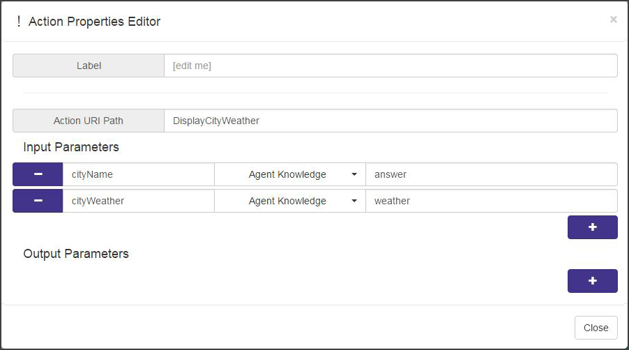

# Tutorial 4: Parallel node #

## Description ##

Use the parallel node to have several actions running.

## Adding a parallel to the behavior ##

In this tutorial we will use the [parallel node](http://doc.craft.ai/behaviors/parallel/index.html) () which allows the simultaneous execution of several branches regardless of the state of the other branches.
In our example, we will simply have 2 actions running in parallel.

First, we will use the action "GetCityWeather", which will retrieve the weather from the [OpenWeatherMap](http://openweathermap.org/) API.
Put the action node at the end of the sequence you already built and configure it as follow:

Then we will have two actions in parallel: one displaying the weather icon on the map ("DisplayCityWeather" action) and a "Say" action displaying the textual result of the request to the OpenWeatherMap API.
Drag a parallel node from the palette and drop it under the main sequence, on the right of the "GetCityWeather" action.
Let's keep the default settings for the parallel node, they already meet our expectations.
Under the parallel node, add two action nodes. Set the first one as described below:

The second action is "Say" with a message being the entity knowledge `weather.description`.

In the end, your resulting behavior tree should look like this:

Now if you run it from [the tutorial page](http://www.craft.ai/tutorials/), inputting a city name in the form should allow you to display a short summary of the current weather in this city as well as the associated icon on the map.

> You can check the final result of this tutorial by running the application with `bts/4` as the `behaviors folder`.
